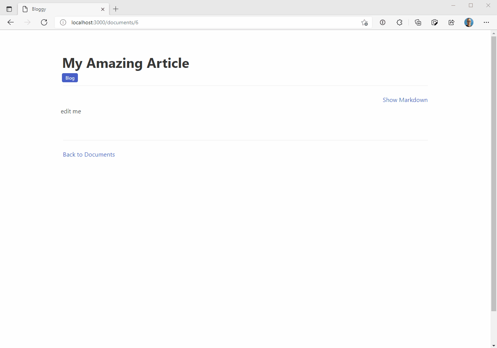

# README

A WYSIWYG Markdown editor, built with in Rails 7, Hotwire, Turbo and Stimulus to showcase that modern front-end doesn't need to be all React and Vue.js ;-)

Follow along with the development of this proof-of-concept project at http://kuy.io/blog

- [Part 1](https://kuy.io/blog/posts/modern-front-end-magic-with-rails-7-a-visual-editor-for-markdown-part-1)
- [Part 2](https://kuy.io/blog/posts/modern-front-end-magic-with-rails-7-a-visual-editor-for-markdown-part-2)
